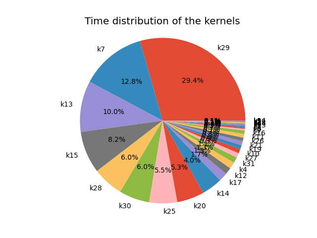
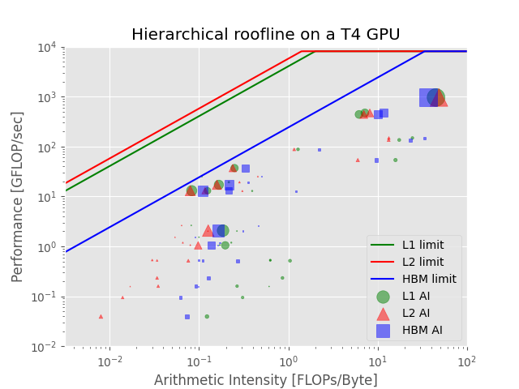

# The Roofline Analysis of the PINN-Heat Equation

This doc describes how to use [Nsight Compute CLI](https://docs.nvidia.com/nsight-compute/NsightComputeCli/index.html)
 (ncu) to study the performance of the PINN-heat equation solution.

## Problem description
The target heat equation is:

$$ u_{xx} + u_{yy} = f(x, y) = -2{\pi}^2 sin(\pi x) cos(\pi y), \ 0<= x, y<= 1$$

with the boundary condition as:

$$ u(0, y) = u(x, 0) = u(x, 1) = u(1, y) = 0. $$

## Methodology
### PINN implementation
The current PINN implementation is using the simplest feed-forward neural networks (NN).
 The NN structure is taken from the Pytorch implementation of the original
 PINN-Burger Equation ([here](https://github.com/jayroxis/PINNs/blob/master/Burgers%20Equation/Burgers.ipynb)).
The network parameters are shown in the below table, which are proved to
 have a considerable $L_2$ error without NN being too complicated. The
 $tanh()$ activation layer is attached after each of the hidden layers and the
 input layer.

Layers|Dimension|Count
---|:---:|---: 
Input layer|2|1
Hidden layer|20|4
Output|1|1

According to PINN definition, the $loss$ function is made up of two parts,
 i.e., $loss_{train}$ from the boundary, and $loss_{pde}$ from the whole
 domain. We take $N=64+1=65$ samples from each of the $x$/ $y$
 direction, thus $loss_{train}$ is of dimension $260 (4N) \times 2$ and
 $loss_{pde}$ is of dimension $4225 (N^2) \times 2$.

$$ loss = loss_{train} + loss_{pde}$$

The NN backward phase is using LBFGS optimizer. Besides, it's using Adam
 for the first 1000 training steps, and LBFGS for the remaining steps.
 In the current implementation, we set the target $loss = 5 \times 10^{-5}$,
 and the training process always stops at $iter=1001$.


### NCU metrics
As we mentioned, the training process takes 1001 iterations to stop.
 The NCU profiling overhead is large and profiling the whole 1001 steps
 is unachievable. Instead, we profile the training process with
 $iter=1/2/4/10$, and compare the time distribution and metric values
 of different $iters$. It turns out each $iter$ has similar performance,
 thus the result of $iter=1$ is still convincible.
 
The NCU metrics needed for the Roofline analysis are listed in the below table.
 A [slurm script](../scripts/prof.slurm) is given to demonstrate the profiling
 process, and the original profiling results are listed in [../metrics-prof/](../metrics-prof/).
 
Group|Metrics|Description
---:|:---|:---
Time|sm__cycles_elapsed.avg, sm__cycles_elapsed.avg.per_second | Elapsed cycles
FP64 FLOPS| sm__sass_thread_inst_executed_op_dadd_pred_on.sum, sm__sass_thread_inst_executed_op_dmul_pred_on.sum, sm__sass_thread_inst_executed_op_dfma_pred_on.sum | Instruction count
FP32 FLOPS| sm__sass_thread_inst_executed_op_fadd_pred_on.sum, sm__sass_thread_inst_executed_op_fmul_pred_on.sum, sm__sass_thread_inst_executed_op_ffma_pred_on.sum | Instruction count
FP16 FLOPS| sm__sass_thread_inst_executed_op_hadd_pred_on.sum, sm__sass_thread_inst_executed_op_hmul_pred_on.sum, sm__sass_thread_inst_executed_op_hfma_pred_on.sum | Instruction count
Tensor Core FLOPS | sm__inst_executed_pipe_tensor.sum | Instruction count
L1 cache | l1tex__t_bytes.sum | Memory size
L2 cache | lst__t_bytes.sum | Memory size
HBM | dram__bytes.sum | Memory size

### Metric aggregation
According to the profiling results, each training iteration executes 680 GPU kernel
 functions, which are of 31 different kernels.

For ease of analysis, we aggregate the metric values by the kernel names.

#### Kernel execution time
For each kernel, the summation of its execution time (in seconds)
 is calculated as below.

```t = sum(#sm__cycles_elapsed.avg) / avg(#sm__cycles_elapsed.avg.per_second)```

#### Throughput
The throughput of different runs of the same kernel can be different. Here
 we aggregate the throughput into one number.

```throughput = sum(instruction counts) / t```

#### Bandwidth
Similarly, the bandwidth is aggregated.

```bandwidth = sum(memory size) / t```

#### Arithmetic intensity
Then the aggregated arithmetic intensity (AI) is got from dividing the throughput
 by the bandwidth.

```AI = throughput / bandwidth```


## Results
The code is run on the farm node `sciml2103` with one Tesla T4 GPU.
 It's a Turing architecture with compute capacity of 7.5.


### Time distribution



Based on our profiling result, one iteration takes about 6.75 milliseconds.
 If we label the 31 kernels as `k1`-`k31`, the percentage time cost by kernels
 is shown in the above figure. We list the top 9 time-consuming kernels
 (with percentage values $\geq $ 4%) in the below table, which occupies
 about 87.2% of the total execution time.

Kernel name | Kernel label | Kernel type | Percentage (%) 
:---|-------------:| ---: |:--------------:|
volta_sgemm_32x128_nt |          k29 | Compute | 29.43
at::native::reduce_kernel<(int)128, (int)4, ...> |           k7 | Compute| 12.79
at::native::vectorized_elementwise_kernel<(int)4, at::native::BinaryFunctor<float, float, float, at::native::MulFunctor<float>, ...>, ...> |          k13 | Non-compute| 9.97
at::native::vectorized_elementwise_kernel<(int)4, at::native::CUDAFunctor_add, ...> |          k15 | Non-compute | 8.21
volta_sgemm_32x128_nn |          k28 | Compute | 6.01
volta_sgemm_32x128_tn |          k30 | Compute | 5.97
splitKreduce_kernel |          k25 | Compute | 5.47
at::native::vectorized_elementwise_kernel<(int)4, at::native::tanh_backward_kernel_cuda...> |          k20 | Compute | 5.31
void at::native::vectorized_elementwise_kernel<(int)4, at::native::BUnaryFunctor<..., at::native::MulFunctor<float>>, ...> |  k14 | Non-compute | 4.05

We can find from the table that the matrix multiplication (`sgemm`) and
 reduce are the two dominant operations.

*The NN forward phase has `sgemm` operations with `_nt` as suffixes only,
 while the backward phase has operations with all the suffixes. TODO: compare
the time of the forward and the backward phase.*

As [Ref 1](https://arxiv.org/pdf/2009.05257.pdf) pointed out, the execution time of the non-compute kernels are non-negotiable.
 In the current implementation, `k13`, `k15` and `k14` are the most time-consuming
 non-compute kernels, which takes about 22.2% of the total time.

### Hierarchical Roofine analysis


We plot the aggregated AI of the 31 kernels in the above roofline chart, with
 the y-axis as the throughput and the x-axis as the AI.

There are two main components in a roofline chart: the lines
 and the scattered markers. The lines stand for the hardware limit, which is irrelevant
 to the GPU application. On the farm T4 GPU, we get a measured peak f32 compute
 power of 8.1 TFLOP/s, a L1 cache bandwidth of 4051.6 GB/s,
 a L2 cache bandwidth of 5760.9 GB/s and a DRAM (HBM) bandwidth of
 241.6 GB/s. When the AI is low, the peak throughput is restricted by the
 memory bandwidth, also called to be memory-bounded. In contrast, when
 the AI is high, the throughput is compute-bounded.

The scattered markers stand for the application's AIs. The methodology to
 calculate the AI is stated in the [metric aggregation](#metric-aggregation) part.
 For each kernel, there are 3 AI values corresponding to the same throughput,
 i.e., L1-AI represented with the circle marker, L2-AI represented with the
 triangle marker, and HBM-AI represented with the square marker. In addition,
 the size of the marker is proportional to the kernel's execution time, and the
 3 AIs of the same kernel are of the same size.

#### Performance bottleneck
The closer the AI marker to the limit, the higher throughput the GPU achieves.
 In the above roofline chart, L1 and L2 AIs are far away
 from the limit, which indicates that the GPU utilization is low,
 where the root cause is that we are using a small NN. If the NN structure is
 more complicated, for examole, with larger layer counts and/or dimensions, and/or
 with larger input datasets, the GPU utilization would be higher. However, as PINN
 is designed without using large dataset, and increasing the complexity of
 the NN does not help to reduce the $L_2$ error much, I do not see much necessity
 in improving the NN complexity here.

#### Top time-consuming kernels
*TODO: list the AIs of the top-9 time-consuming kernels, compute the
utilization rate.*

## Summary
We summarize the findings of our PINN implementation as follows.

- Matrix multiplication and reduce are the most time-consuming operations
 in the current implementation. Non-compute kernels also take up
 considerable time.
- The overall performance bottleneck is the low GPU utilization, caused by
 the small dataset and simple NN structure.

## Problems and to-dos
* I was unable to declare a NN structure of double precision with C++ APIs.
 I do not know whether this is restricted by my knowledge, or by the libtorch API
 itself.

* The current problem dimension $N=65$ shows a low utilization of the
 GPU computing power. However, the CPU PHASM surrogate model with this size
 already make the farm node out-of-memory. There should be bugs in the current
 PHASM surrogate APIs that they tend to call too much memory.

* The two farm GPUs, Turing Tesla T4 and Turing TitanRTX are equipped with
 the tensor cores, which have much higher matrix multiplication bandwidth
 than the normal GPU cores. However, based on the profiling result, the tensor
 cores are never used. Investigation into this issue is critical to further
 improve the application's performance.

* More data processing. Like the accurate compute/non-compute kernel ratio, the
 utilization rate compared to the limit of each kernel, etc.

## References
1. NCU Roofline profiling paper: https://arxiv.org/pdf/2009.05257.pdf
2. Raissi's PINN paper: https://maziarraissi.github.io/PINNs/
